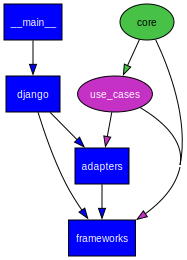

# onion-tasks

Task manager application illustrating the Onion/Clean/Hexagonal architecture pattern with Python + Django.

## Dependency Graph



## 🏗️ Architecture Overview

```
🌐 Frameworks & Drivers   (Django, CLI, Database)
🔌 Interface Adapters     (Controllers, Repositories, Serializers)
🎯 Use Cases              (Business Logic, Application Services)
💎 Domain                 (Entities, Value Objects, Business Rules)
```

### Layer Structure

- **`core/`** - Domain entities and "enterprise" business rules (no external dependencies)
- **`use_cases/`** - Application business logic and workflows
- **`adapters/`** - Interface adapters for web, persistence, and external services
- **`frameworks/`** - Framework-specific code (Django configuration, CLI setup)

## 🚀 Features - WIP

- Create and manage tasks with dependencies
- Assign tasks to agents
- Track task status and costs
- RESTful API endpoints
- Command-line interface
- Clean separation of concerns
- Comprehensive test coverage

## 🛠️ Technology Stack

- **Backend**: Python 3.13+, Django
- **Database**: SQLite
- **Testing**: pytest, pytest-django

## 📋 Prerequisites

- Python 3.13+
- uv

## 🧪 Testing

Run all tests with coverage:

```bash
# Run all tests
pytest

# Run with coverage report
pytest --cov=. --cov-report=html
open htmlcov/index.html

# Run specific layer tests
pytest use_cases/          # Domain and application logic
pytest adapters/tests/     # Interface adapters
```

## 📁 Project Structure

```
onion-tasks/
├── core/                           # 💎 Domain Layer
│   ├── entities/                  # Business entities
│   ├── value_objects/             # Immutable value objects
│   └── exceptions/                # Domain exceptions
├── use_cases/                      # 🎯 Application Layer
│   ├── use_cases.py              # Business workflows
│   ├── interfaces.py             # Repository contracts
│   └── dtos.py                   # Data transfer objects
├── adapters/                       # 🔌 Interface Adapters
│   ├── web/                      # HTTP controllers and views
│   ├── persistence/              # Database repositories
│   └── cli/                      # Command-line interface
├── frameworks/                     # 🌐 Frameworks & Drivers
    ├── webapp/                   # Django configuration
    ├── cli/                      # CLI application setup
    └── database/                 # Database setup

```

## 🎯 Clean Architecture Benefits

This project demonstrates:

- **Independence**: Business logic is independent of frameworks, databases, and UI
- **Testability**: Core business rules can be tested without external dependencies
- **Flexibility**: Easy to swap out databases, web frameworks, or add new interfaces
- **Maintainability**: Clear boundaries make the codebase easier to understand and modify

## 🔧 Development

### Adding a New Feature

1. **Define entities** in `core/entities/`
2. **Create use cases** in `use_cases/`
3. **Implement adapters** in `adapters/`
4. **Wire up frameworks** in `frameworks/`
5. **Add tests** for each layer

### Running in Development

```bash
# Start development server with auto-reload
./manage.py runserver

# Check code coverage
pytest --cov=. --cov-report=term-missing
```

## 🌟 Key Design Decisions

- **No Django models in core** - Domain entities are pure Python
- **Repository pattern** - Abstract data access from business logic
- **Dependency inversion** - Outer layers depend on inner layer abstractions
- **Use case driven** - Application organized around business workflows
- **Framework agnostic core** - Business logic can work with any framework

## 📚 Learning Resources

- [Clean Architecture by Robert C. Martin](https://blog.cleancoder.com/uncle-bob/2012/08/13/the-clean-architecture.html)
